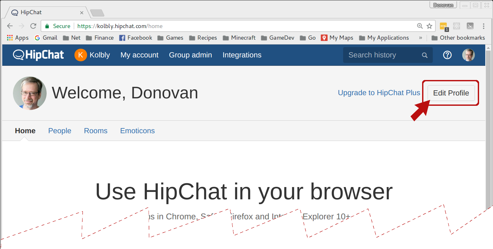
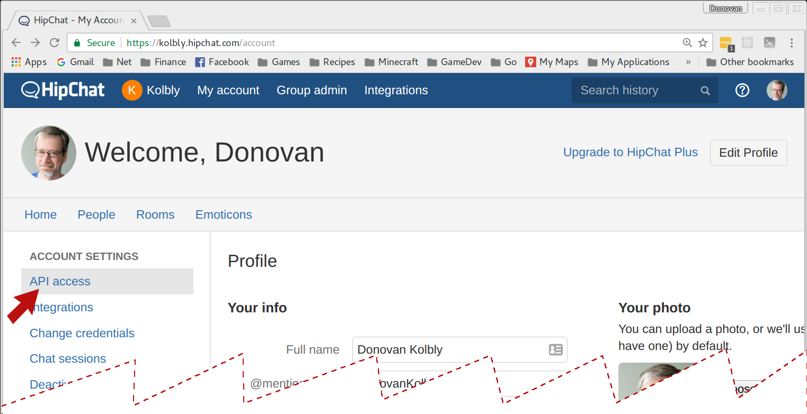
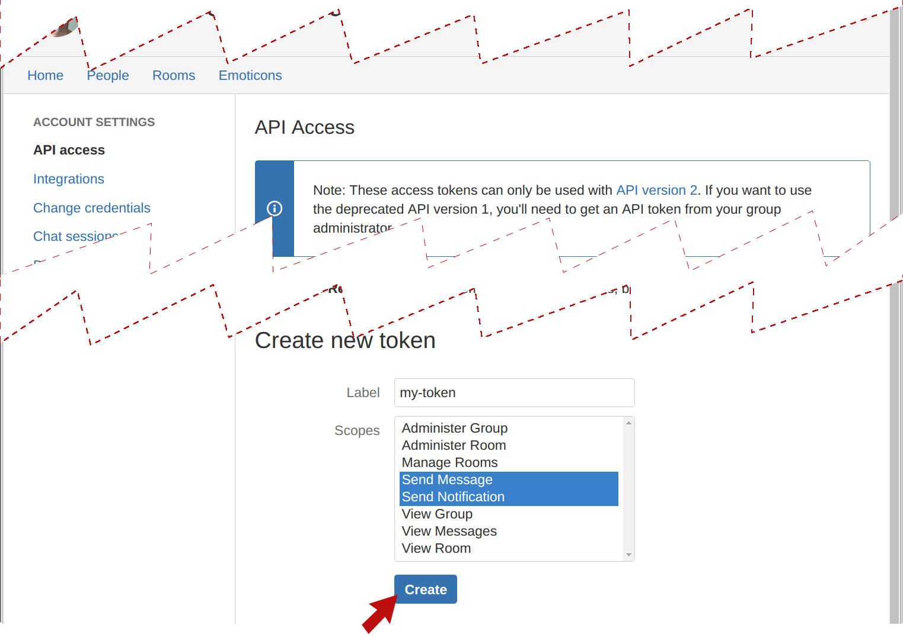
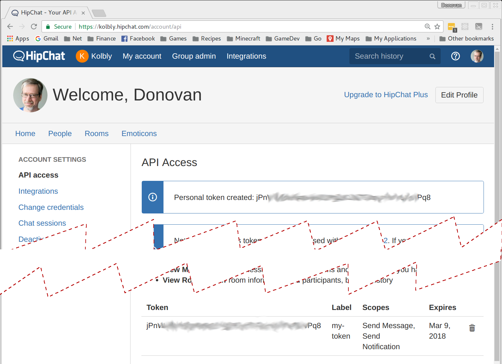
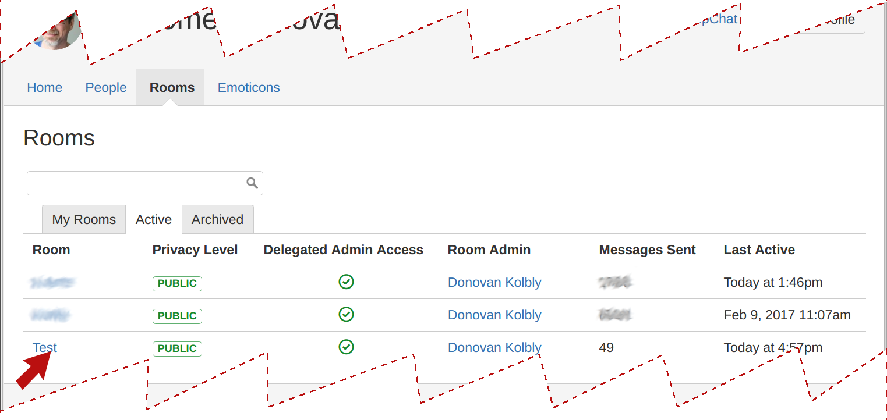
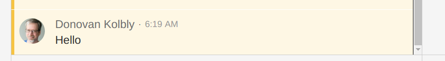
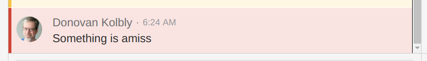
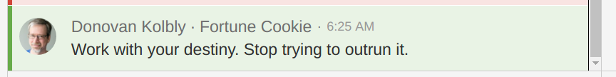

Tutorial
========

Here is a step-by-step tutorial on how to use this command-line
tool to integration with [HipChat][hc].  This tutorial only
describes `v2` access.

## Obtaining an Access Token

In order to talk to the hipchat servers, you will require an access
token.  This is easily obtained from your profile.

Log in to your site's home page, http://_site_.hipchat.com

From the home page, click on the Edit Profile button.  You may need to
re-authenticate, but that should bring up your profile page:

There, on the left menu is a panel for **API access**.  Click
that to bring up the API access management page:

At the bottom of that page is a **Create new token** section;
select the scopes you want (for normal posting of messages
to a room, all you need is the _Send Notification_ scope).
Give the token a label so you can remember later why you created
it, and click **Create**.
That should update the page to include the new token:

The Personal token is the one you want.  Save it off for later use.

## Obtaining a Room API ID

Now you need to figure out the room ID.  Click on the **Rooms**
tab in the admin page.

You can search for the room or rooms you are interested; in this case
I only have a few.  Click on the name of the room of interest to get
its details:

The room details page includes the **API ID** of the room, which is
what you will use in the CLI to send messages to that room.

## Sending Messages

Now you have all the information needed to send messages.  (Note that
the API keys obtained in the first step are is only for v2 of the API,
be sure to include the HIPCHAT_API settting)

    export HIPCHAT_TOKEN=jPn....Pq8
    export HIPCHAT_ROOM_ID=32...8
    export HIPCHAT_API=v2
    echo Hello | ./hipchat_room_message

Congratulations!  That should have sent a message to your room.

Also, if you like, you can configure these variables in a `~/.hipchat
file, which will be sourced by the command-line tool.

### Getting Fancy

There are several options that can be used to make your messages
a little fancier.

#### Color

The `-c` option sets the background color of the message:

    echo Something is amiss | ./hipchat_room_message -c red

#### From

You can use the **from** option (`-f) to mark your message as
being from a particular place.

    echo Work with your destiny. Stop trying to outrun it. | \
      ./hipchat_room_message -c green -f "Fortune Cookie"

#### Inline markup

The message body supports HTML-style inline markup.

    echo '<b>Scorpio:</b> <i>Carpe diem!</i>' | \
      ./hipchat_room_message -c green -f "Fortune Cookie"

[hc]: http://www.hipchat.com
